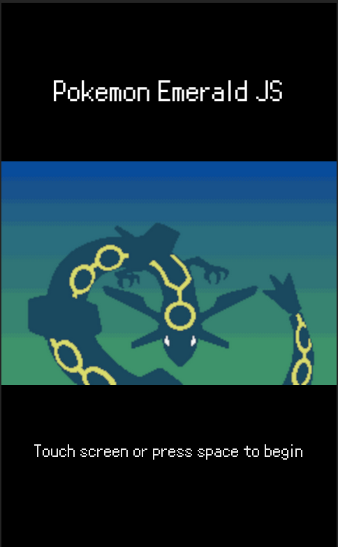
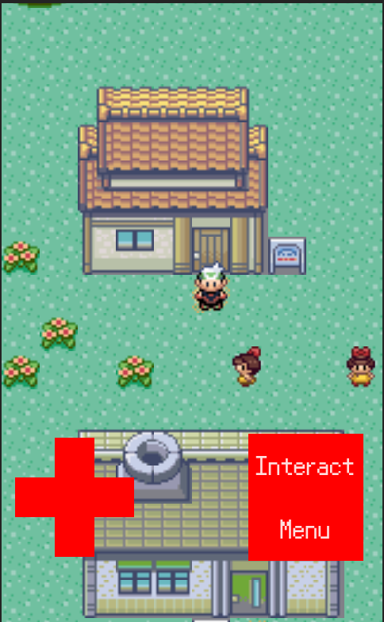

# POKEMON EMERALD JS

This is me trying to recreate Pokémon mechanics using Phaser 3, Tiled, Vite and Nodejs.
The purpose of this was purely educational, so that I could learn a bit about how game development works.
Needless to say this was an interesting and insightful endeavour!

You can check it out online [here](https://pokemon-emerald-js.web.app/).

## Features

The current state of the game is:

- Start Menu
- Scene transitions
- Grid Based movement with collision
- Moving NPCs
  - Ability to interact with NPCs

Implementing the battle system was planned, but as it is mostly menus rather than logic I lost interest, as I realised
it would be quite time-consuming to do all of this UI and it was feeling rather tedious. I am nevertheless satisfied 
with what I did get done, the goal was never to recreate the whole game!

Most of the graphics are rendered using phaser, but menus and UI are using HTML. The canvas size is a fixed size and
designed specifically to support mobile, included is some simple mobile UI for interacting with the game as well. It
was initially going to be responsive, but I changed my mind to focus on a more mobile friendly experience later. It can
still be played on computers!

## Project setup

This project uses <b>Node 21.6.2</b>

To run a local dev server:

```bash
  npm i
  npm run dev
```

To create a build:
```bash
  npm run build
```

You can enable additional debugging features by creating a .env.development file and including `VITE_DEBUG=1`, These
features only appear when running a local dev server and will not be included within builds.

An additional script is included to "extrude" tiles within tile ```npm run extrude-tiles```, this is to pad tilesets
to prevent rendering issues when used for tilemaps due to the camera zoom.

## Known Issues

- When using the interact button to interact with npcs, if using touch (such as on a phone) if you finish the conversation
by pressing the same position as the interact button, it will instantly interact with the npc again.
- The menu button does nothing, as it was not implemented.
- The mobile controls do not work on desktop (they use touch events). You can still play by using arrow keys to move and space to interact.
- The code is messy, as I changed direction many times and was figuring it out as I went! Do not expect optimally written code.

## Screenshots

### Main menu


### In game
